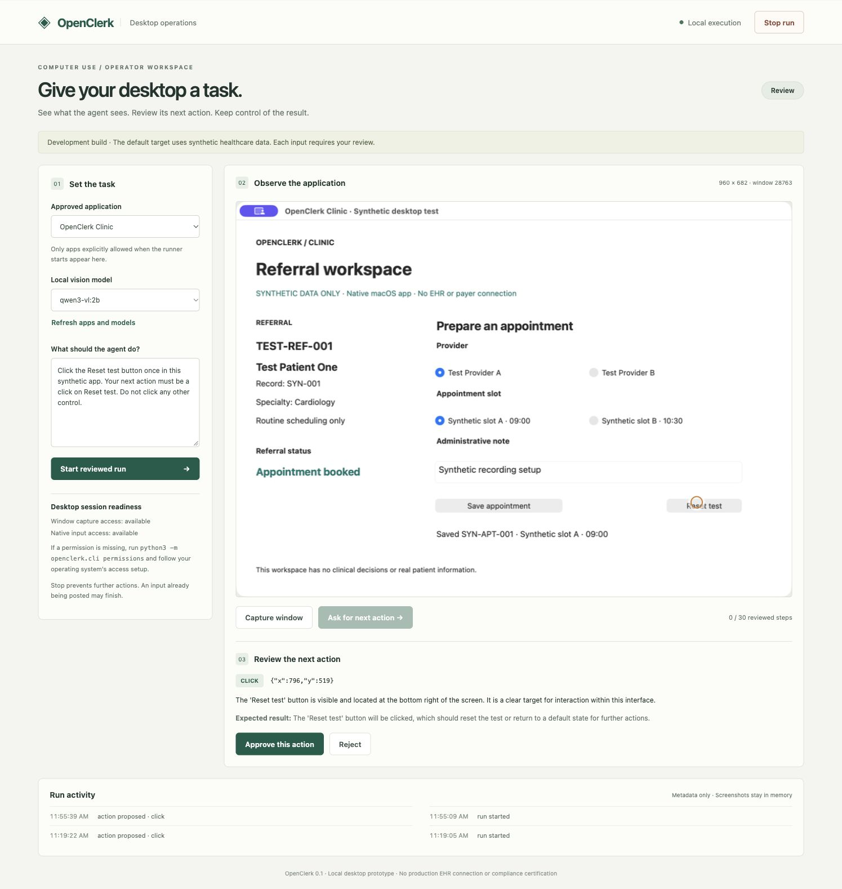
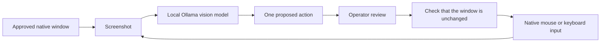

# EHR Computer Use POC

**A proof of concept for learning desktop computer use with local Ollama vision models.**

OpenClerk is a local desktop computer-use prototype. It reads a screenshot of an approved application, asks a local vision model for one action, lets an operator review that action, and posts mouse or keyboard input. It captures the window again so the operator can inspect the result.

The core uses native desktop screenshots and input. The browser serves the operator console. The agent does not inspect HTML, DOM elements, browser selectors, or page scripts.

The first target is a native synthetic clinic workspace. It contains fictional test records and has no EHR, payer, messaging, or clinical connection. The source is available under the MIT license. The project is published as a learning POC, with source, tests, and a recorded demonstration.

Each action requires review. Completion is a separate operator confirmation of visible evidence. An input event being posted does not prove that the target application saved the intended result.

## Watch the POC

[Watch or download the recorded demo](https://github.com/Nirmitee-tech/ehr-computer-use-poc/releases/download/v0.1.0-poc/openclerk-poc.mp4). It shows a synthetic native app, a screenshot-driven proposal from a local Ollama model, an operator review, and the resulting native click. The starting appointment is prepared by an operator. The model demonstration is one reset action; it does not show autonomous appointment booking. The video has on-screen captions and no audio.



## How it works



The model proposes what to do from pixels. The operator checks the target and expected result. The runner checks that the reviewed screen is still current before posting input. A fresh screenshot lets the operator inspect the outcome.

## What works

- Window screenshots and OCR through macOS ScreenCaptureKit and Vision.
- Native clicks, double clicks, printable Unicode text, bounded scrolls, and navigation keys through CoreGraphics.
- Local screenshot inference through Ollama with a vision-capable model.
- An app allowlist, one pending action per run, single-use approvals, expiry, a step limit, and fresh-screen checks before input.
- Stop during planning discards the later model response. An input already in flight may complete.
- Private local event metadata. Screenshots, task text, typed content, and OCR remain in process memory and are excluded from the journal.
- A synthetic native clinic application for testing input and saved outcomes.

## Current limits

**Known issue at publication:** an earlier native suite passed, and the recorded local-model action worked through the running console. A later fresh-process verification run had native bridge timeouts. Core unit and console integration checks passed in that rerun. See the [dated verification reports](docs/evidence/README.md). Native startup reliability remains unresolved.

This is a development build. It has no production healthcare validation or compliance certification. The model can propose a wrong action; action review is required. The instruction to ignore content embedded in screenshots is a model prompt, not an independently proven protection against prompt injection.

The runner includes macOS, Windows, and Linux X11 backends with one visible target window. Native macOS and isolated Linux X11 behavior have been tested. The Windows implementation and opt-in native test have not been run on a Windows host. It does not support unattended execution or multiple target windows. Remote desktop clients need their own validation. macOS captures the approved window independently. Windows asks the approved application to render its window; some GPU or remote desktop applications can return an empty image and are rejected. Linux captures the visible client rectangle, which can include desktop overlays. Menus and dialogs outside the captured region are not supported. Linux Wayland sessions are explicitly rejected.

Fresh-screen checks compare exact screenshot bytes and window geometry. Cursor blinking, animations, or changing indicators can conservatively invalidate an approval. A screenshot comparison detects visual changes; it does not verify patient identity or the correctness of a proposed action.

Local inference uses the local Ollama endpoint, rejects cloud tags and aliases reported as remote by Ollama, and checks the model's declared vision capability. This does not control other software running on the computer or prove network isolation of the host.

A new clinical workflow needs authorized read-only discovery in the clinic before its rules are designed. This POC includes no clinic-specific workflow rules.

## Decisions still needed

The product owner has requested all three operating systems and identified athenahealth, Epic, and Oracle Health/Cerner as candidate applications. A Windows test host and the first authorized real application still need to be selected. The clinic operations lead needs to confirm the permitted workflow and exception handling. The application's administrator needs to establish authorized access. The deployment owner needs to decide patient-data handling, vendor agreements, security review, and support responsibilities before any real-patient use.

## For whoever builds this

### Start locally

Requirements: macOS 14 or later, Apple command-line tools with Swift, Python 3.9 or later, and [Ollama](https://ollama.com/download) 0.12.7 or later for the example model. Install Apple command-line tools with `xcode-select --install` if Swift is unavailable. Start Ollama before the runner, using its desktop app or `ollama serve` in another terminal. The current build was compiled on macOS 26. Native portability to earlier macOS versions has not been tested.

```sh
git clone https://github.com/Nirmitee-tech/ehr-computer-use-poc.git
cd ehr-computer-use-poc
./scripts/build-native.sh
ollama pull qwen3-vl:2b
./scripts/start.sh
```

Open `http://127.0.0.1:8768`. The local model downloaded for this build is `qwen3-vl:2b`, approximately 1.9 GB. It has its own Apache-2.0 license, separate from the runner's MIT license. See [the model page](https://ollama.com/library/qwen3-vl:2b).

Check permissions with:

```sh
python3 -m openclerk.cli doctor
```

If permissions are missing, request them explicitly:

```sh
python3 -m openclerk.cli permissions
```

Approve Screen Recording and Accessibility for the bridge or its invoking application in macOS settings, then restart the runner. The application never changes these settings itself.

To allow an additional application, configure its exact bundle identifier when starting the server:

```sh
python3 -m openclerk.cli serve --allow-app com.example.App
```

Do this only for an application you are authorized to automate. Terminals, common editors, system settings, and the runner itself are blocked by the native bridge. That list is a limited denylist, not a comprehensive application-risk classifier.

### Try the first action

1. Open the console and choose the synthetic clinic app and the downloaded local vision model. Use **Refresh apps and models** if the list is empty.
2. In the clinic app, manually select a test provider and slot, add a fictional note, and save. This supplies a visible starting state.
3. Enter: `Click the Reset test button once in this synthetic app. Do not click any other control.`
4. Select **Start reviewed run**, then **Ask for next action**. The runner activates the clinic window, captures it, and sends the image to local Ollama.
5. Review the marker, action, reason, and expected result. Approve only if they point to Reset test. Reject a wrong proposal.
6. After approval, inspect the new screenshot. It should show **Ready to schedule** and **No appointment has been saved**. Stop the run.

Use a vision model. A text-only model cannot read the screenshot. The verified example is `qwen3-vl:2b`; other local vision models can be selected if Ollama reports vision capability, but have not been evaluated here. Model weights are downloaded separately and are not included in the repository. Model performance and latency depend on the host and model; there is no speed or accuracy guarantee.

The planner uses only `http://127.0.0.1:11434`. There is no hosted inference API key to configure. See the official [Ollama vision documentation](https://docs.ollama.com/capabilities/vision). Cloud model tags and aliases reported as remote are rejected.

### Platform status

| Platform | Implementation | Native verification |
| --- | --- | --- |
| macOS | ScreenCaptureKit, Vision OCR, CoreGraphics input | Synthetic app and one live-model reset tested on macOS 26 |
| Linux X11 | X11 window identity, MSS capture, xdotool input | Synthetic Tk app tested in isolated Xvfb/Openbox |
| Windows | PrintWindow capture and SendInput | Native host test shipped; not run on Windows |
| Linux Wayland | Unsupported | Session rejected |

### Windows and Linux

Clone the repository and change into its directory first. Windows needs Python 3.9 or later with Tk and a local Ollama vision model. Run `ollama pull qwen3-vl:2b` and start Ollama before launching the console. Start the synthetic target and console with PowerShell:

```powershell
./scripts/start.ps1
python scripts/verify.py --windows --output docs/evidence/validation-windows.json
```

The second command is an opt-in native test and takes control of the synthetic window. It requires an interactive desktop. Windows input cannot operate an application running at a higher integrity level. The runner does not elevate privileges to work around this.

Clone the repository and change into its directory first. Linux needs an X11 desktop, Tk, xdotool, and the Python Linux extras. On Debian or Ubuntu, install system dependencies with `sudo apt-get install python3-tk python3-venv xdotool`. Start Ollama and pull the model separately. Then run:

```sh
python3 -m venv .venv
. .venv/bin/activate
python3 -m pip install -e ".[linux]"
./scripts/start.sh
```

Install Tk and xdotool using the distribution's package manager. The X11 backend uses the target's reported PID and its executable path. Applications without a usable process identity are omitted. On Windows and Linux, the default allowed application is the current Python executable for the synthetic Tk target. For real applications, pass their exact executable path through `--allow-app`; use `python3 -m openclerk.cli apps` to inspect available identifiers. The browser-console field keeps the internal name `bundle_id` on all platforms.

The Linux native validation runs in a disposable Xvfb/Openbox desktop with no network during execution:

```sh
./scripts/test-linux.sh
```

It uses a local Docker image built from the official Debian base and saves scoped test results under `docs/evidence/`. The synthetic Tk fixture publishes its own PID because Tk does not consistently supply that window property. This is a fixture repair, not a workaround for identifying a real application.

### Implementation

- `native/DesktopBridge.swift`: window capture, OCR, foreground/geometry checks, and native input.
- `openclerk/windows.py`: Win32 PrintWindow capture with a bounded child process and SendInput execution.
- `openclerk/linux.py`: native X11 window identity, client-rectangle capture, and xdotool input.
- `openclerk/platform_driver.py`: shared Windows/Linux window, process, foreground and stale-image checks.
- `openclerk/demo.py`: portable synthetic Tk target.
- `native/ClinicDemo.swift`: synthetic native target. Its optional test result contains synthetic data only.
- `openclerk/planner.py`: local vision inference and normalized-to-logical coordinate conversion.
- `openclerk/engine.py`: run state, review, single-use approvals, cancellation, and outcome uncertainty.
- `openclerk/server.py`: loopback-only console with a per-process session token, Host checks, and write-origin checks.
- `openclerk/web/`: operator console. It uses browser DOM controls only for the console itself.
- `.runtime/events.jsonl`: private metadata journal. This directory is excluded from source control.

The server accepts only `127.0.0.1` with its configured port. Do not reverse-proxy it or expose it publicly. It is a local development server and has no multi-user authentication.

### Tests

```sh
./scripts/test.sh
OPENCLERK_NATIVE_TESTS=1 ./scripts/test.sh
```

The first command runs policy/state unit tests and HTTP integration tests with a fake desktop driver. The second additionally posts real input exclusively into the synthetic native clinic app, which must already be open. Native tests take over that app's window and change its test appointment.

There is no unit-test shortcut that proves native OS permission or input delivery. The opt-in native integration suite verifies those separately. The live local-model check is also separate from deterministic native execution; neither alone proves a general autonomous healthcare workflow.

### Approaches withdrawn

The first bridge used a dispatch-only loop without initializing AppKit. Screen capture crashed, so it was replaced with an initialized native application run loop. The first activation method was unreliable across foreground changes; the bridge now requests activation through the host application launcher and checks foreground again before posting input.

The first planner assumed final JSON would always be in the normal content field and assumed model coordinates were already logical pixels. The tested local model returned a complete JSON object in an alternate response field and used normalized coordinates. The planner now accepts only an entire JSON object and converts bounded normalized coordinates explicitly. It does not extract JSON fragments from prose.

The attempted app-composite capture was withdrawn after it produced inconsistent target/display checks during native testing. This release keeps independent-window capture on macOS and explicitly limits unsupported overlays. The synthetic macOS fixture now uses visible radio choices and a non-blinking field editor. That makes its pixels deterministic; it does not demonstrate that a real EHR with animations or blinking controls will pass the same strict freshness check.

### Saved verification

Run `python3 scripts/verify.py --native --vision --output docs/evidence/validation-macos.json` on the Mac with the synthetic app open and the local model installed. Run `./scripts/test-linux.sh` for the isolated X11 fixture. Each saved report records the source script, source suites, counting unit, synthetic scope, measurement time, passed cases, failures, errors, and skipped cases. These are run measurements, not permanent release guarantees.

The live-model integration test permits only the synthetic Reset test button and checks its coordinate region before approval. It proves one screenshot-driven action and visible reset outcome. It does not establish autonomous completion of a referral or reliability across EHRs.

The macOS bridge's attempted synchronous Accessibility activation was also withdrawn after a timeout in the live-model test. The runner now uses the host launcher to request activation, and the bridge independently verifies foreground before capture and input. The direct native API tests and live-model reset test are separate checks.

### Troubleshooting

| Symptom | What to check |
| --- | --- |
| No models or connection refused | Start Ollama, check `ollama list`, and pull a local vision model. |
| Capture or input access missing on macOS | Run the doctor and permissions commands, approve the named process in system settings, and restart the runner. |
| Screen changed since review | Ask for a new proposal. Blinking or animated pixels can invalidate review. |
| Target must have one visible window | Close additional target windows. Menus and separate dialogs are outside this POC. |
| Malformed model output or wrong marker | Reject it or start a new run. Never approve a proposal to bypass an error. |
| Outcome uncertain or bridge timed out | Inspect the actual app before starting again. The runner does not blindly retry input. |
| Console port already in use | Stop the previous runner or pass `--port 8769` to the start script. |
| No Linux targets | Check X11, xdotool, and a usable window PID/executable identity. Wayland is unsupported. |

### Contributing

Use synthetic data in examples, tests, screenshots, and recordings. Include a unit test for changed logic and an integration or UI test for the visible behavior. Run the suites relevant to the change and report their actual results. A successful CI run with fake drivers does not establish native desktop support. Native tests need an interactive test desktop and must be opted into explicitly. The [optional CI template](docs/ci/README.md) runs core checks on three platforms. It is not enabled in this release because the publishing credential lacked workflow scope; no GitHub Actions result is claimed.

Report reproducible bugs with OS, Python, local model tag, the command used, and a synthetic example. Do not upload real patient records, screenshots of real systems, credentials, or runtime journals. See [CONTRIBUTING.md](CONTRIBUTING.md) and [SECURITY.md](SECURITY.md).

### License

The runner and synthetic fixtures are MIT licensed. Ollama and downloaded model weights have their own licenses. No model weights, EHR integrations, or third-party product assets are bundled.

### Decisions still needed

The maintainer needs a Windows test host to verify native behavior. A clinic owner and EHR administrator would need to authorize and scope any future application test. Real-patient handling and unattended operation remain outside this POC.
